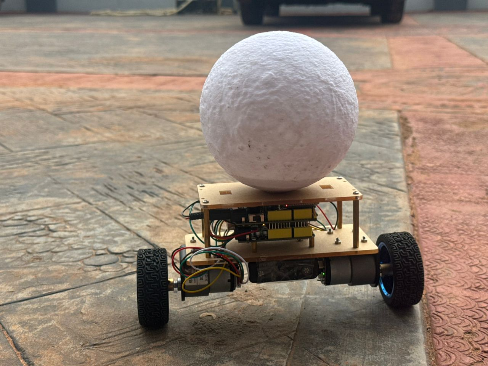
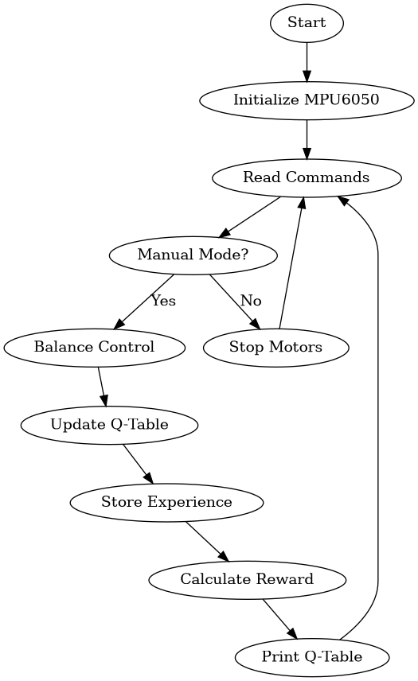

# Reinforcement learning (RL) Self-Balancing Robot

## Overview
This project features a self-balancing robot using an Arduino Uno and a MPU6050 sensor. The robot learns to maintain its balance through reinforcement learning.

## Hardware Components
- Arduino Uno
- MPU6050 Sensor
- DC Motors
- Bluetooth Module

## Usage
- Use Bluetooth commands to control the robot.
- The robot can operate in manual and balance modes.

## Diagrams
- Robot: 
- Flow Chart: 

